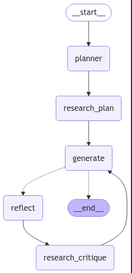

# Report Writing Assistant 🚀

A multi-agent researcher system built with **langgraph** and specialized tools. This assistant orchestrates powerful web searching and advanced multi-step planning to help you gather and analyze information with ease. Whether you’re exploring an academic topic, developing a business proposal, or crafting a technical document, this system will simplify your workflow from start to finish.

**Use local models or cloud-based services** — the choice is yours. Privacy, performance, and flexibility are our top priorities, so you can tailor this application to fit your unique needs.

[**Try the hosted app here!**](https://ishmam97-report-writer-report-writerapp-iuef1c.streamlit.app/)

---

## Architecture Overview

Below is a high-level illustration of how the multi-agent system is structured. This diagram shows the flow of information between different agents and tools.



---

## Features

- **Multi-Agent Research**: Leverages multiple agents working together to gather data from various sources.
- **Advanced Planning**: Creates a detailed plan for writing a comprehensive report.
- **Web Searching Capabilities**: Integrates with search tools to collect and synthesize relevant information.
- **Local or Cloud LLM**: Seamlessly switch between local language models or OpenAI's language models (via API keys).

---

## Getting Started

1. **Clone the repository**:
   ```bash
   git clone https://github.com/yourusername/your-repo-name.git
   cd your-repo-name

2. **Install dependencies** (preferably in a virtual environment):
   ```bash
   pip install -r requirements.txt

3. **Add your API keys**:
    - OpenAI API Key for language model access
    - Tavily API Key for the researcher services

4. **Run the Streamlit app**:
    ``` streamlit run report_writer/ReportWriterApp.py ```

5. **Navigate to**:
    http://localhost:8501/  (or the specified URL in your terminal)

## How to Use

1. **Enter API Credentials**: Provide your OpenAI and Tavily keys.  
2. **Specify a Topic**: Input your research topic.  
3. **Click "Submit"**: The system will:  
   - Plan your report  
   - Conduct multi-agent research  
   - Generate drafts and critiques  
4. **Check the Final Draft**: Once complete, you’ll see a final draft of your report.

---

## Roadmap

- **Additional Tool Integrations**: Enhance searching capabilities with more specialized data sources.  
- **Extended Local Model Support**: Further improve offline usage for privacy.  
- **Refinements and UI Enhancements**: Continue polishing user experience and automation steps.

---

## Contributing

Contributions, feature requests, and bug reports are welcome!  
Feel free to open an [issue](#) or submit a [pull request](#).

---

## License

This project is licensed under the MIT License - see the [LICENSE](LICENSE) file for details.
